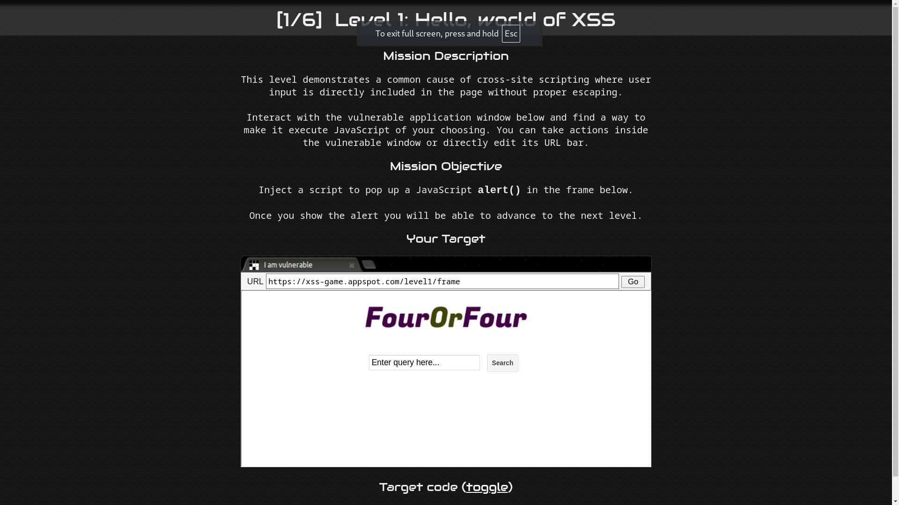
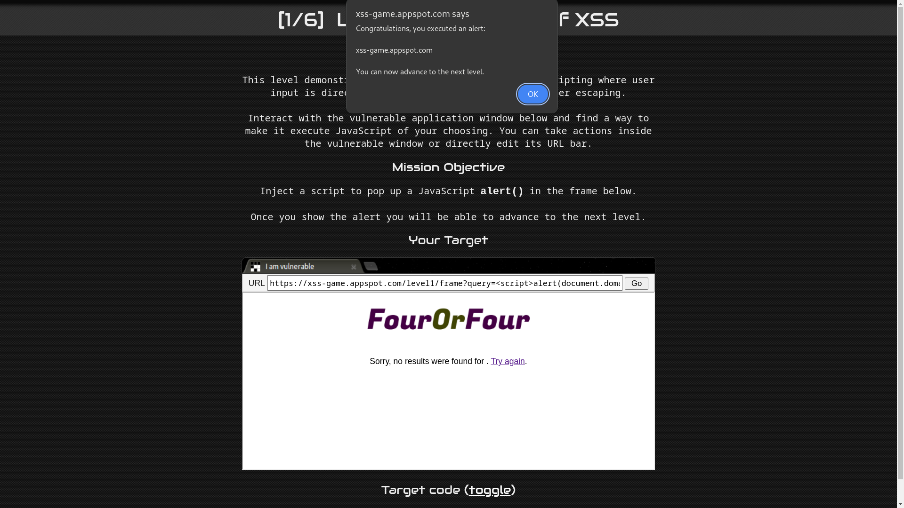

# Level 1: Hello, world of XSS

URL: [https://xss-game.appspot.com/level1/frame](https://xss-game.appspot.com/level1/frame)



## Mission Description

This level demonstrates a common cause of cross-site scripting where user input is directly included in the page without proper escaping.

## Mission Objective

Inject a script to pop up a JavaScript alert() in the frame below.

## Analysis

The first step is to analyze the application and observe how it works. This level contains search functionality. After submitting the search query, it is reflected on the webpage and URL through the query parameter. The search query is returned to the webpage without any escaping or sanitization.

To pop an alert(), we can just inject a script tag with an alert code.

```javascript
    <script>alert(document.domain)</script>
```

OR

Set query parameter of url to the payload.

```bash
    https://xss-game.appspot.com/level1/frame?query=<script>alert(document.domain)</script>
```


