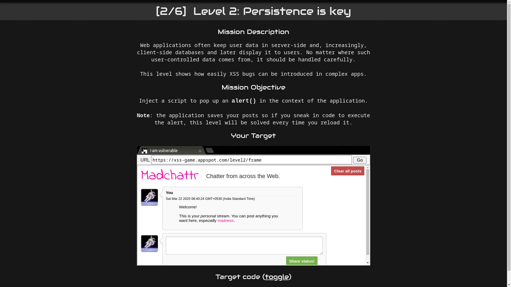
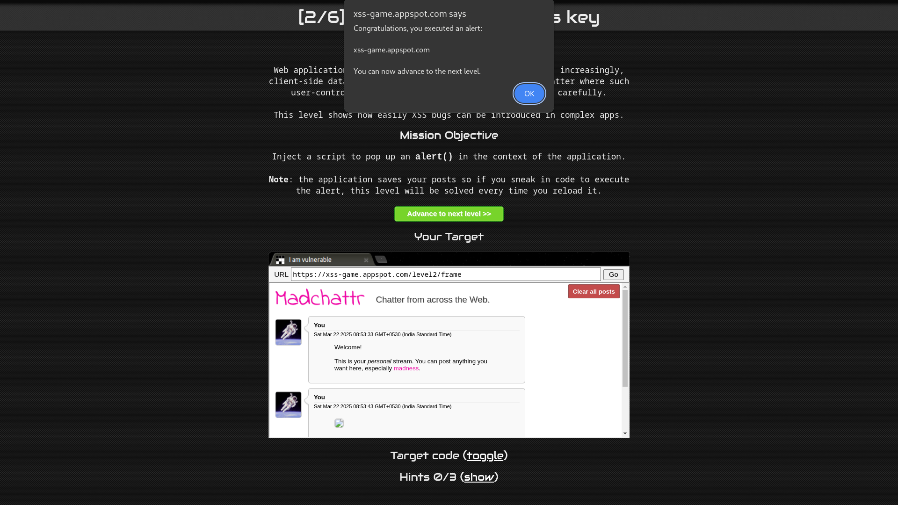

# Level 2: Persistence is key

URL: [https://xss-game.appspot.com/level2](https://xss-game.appspot.com/level2)



## Mission Description

This lab contains a share status form that lets users post status, which the application stores on the server side and later displays to the user.

## Analysis

If we try to inject a script tag `<script>alert(document.domain)</script>` it won't work. It seems like there is a validation that prevents us from using the script tag. However, the share status functionality doesn't escape HTML tags, and we know that we can execute JavaScript code with the help of HTML attribute tags like onclick, onload, and onerror.

## Conclusion

Let's try to inject an image with an invalid src and onerror attribute.

```html

```

Sweet, we can pop an alert box with an image payload. The page will try to load the image from source 'x' , which will fail and trigger the onerror attribute.


