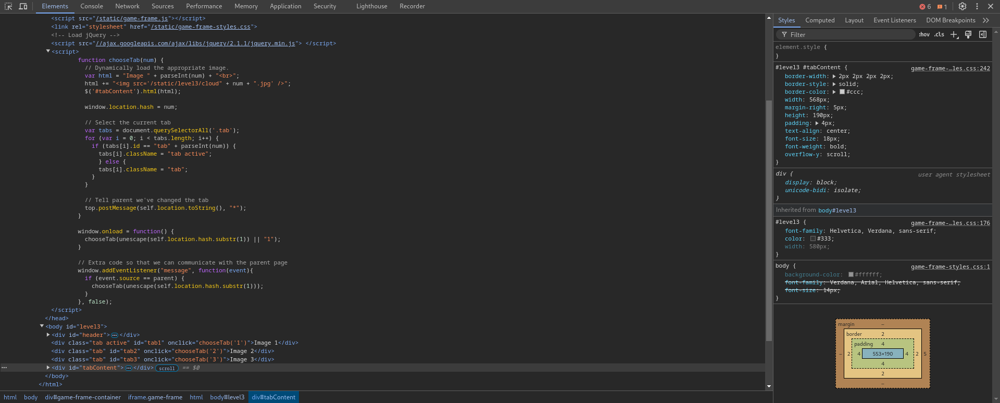
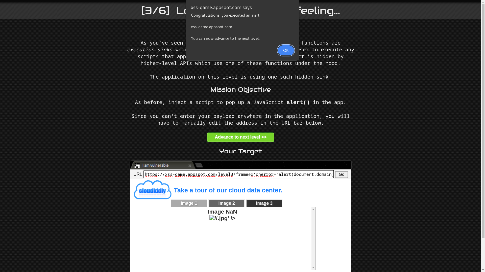

# Level 3: That sinking feeling...

URL: [https://xss-game.appspot.com/level3](https://xss-game.appspot.com/level3)


## Mission Description

Some common JS functions are execution sinks which means that they will cause the browser to execute any scripts that appear in their input. Sometimes this fact is hidden by higher-level APIs which use one of these functions under the hood.

## Analysis

After some analysis of the level, it is concluded that the page loads the image based on the number after the fragment identifier(`#`). The images are loaded based on the number presented in the URL with the help of the `chooseTab(num)` function.



## Conclusion

The website doesn't perform adequate validation, thus it is possible to inject a malicious fragment that will break out of the DOM and execute malicious JavaScript code in a context beyond the intended scope of the application.

Payload:

```html
x'onerror='alert(document.domain)'>//
0'onerror='alert(document.domain)'>;//
```

### How does the payload work?

The `ChooseTab()` function adds the fragment it takes from the URL to the image source without any encoding or validation. Thus, we can break out of the DOM by closing the src attribute with a single quote and then add an **onerror** attribute with an alert function.

### Here's how our payload break out of DOM



