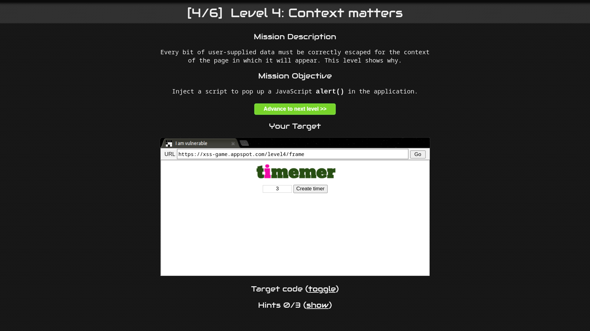
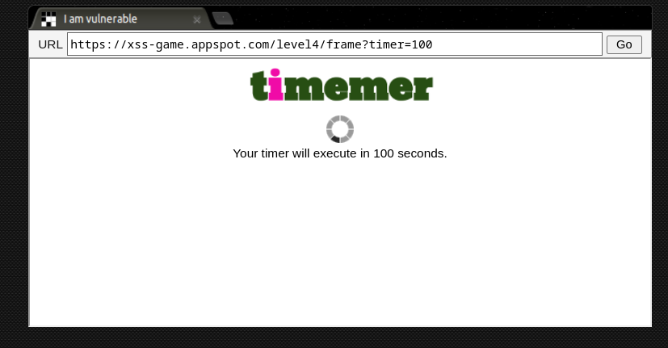
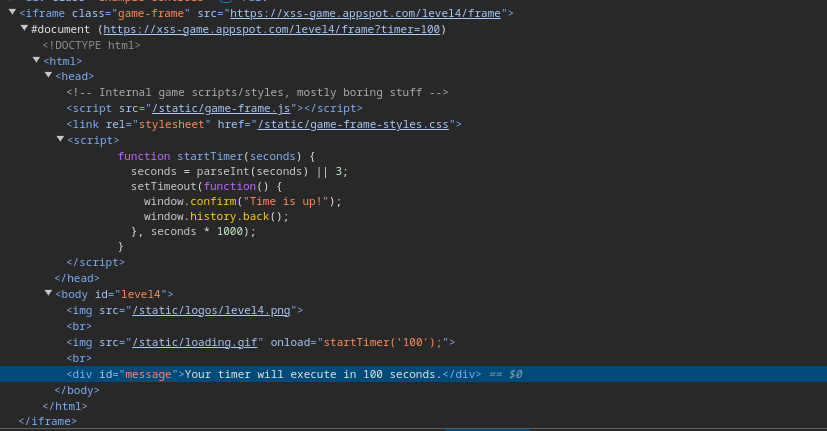
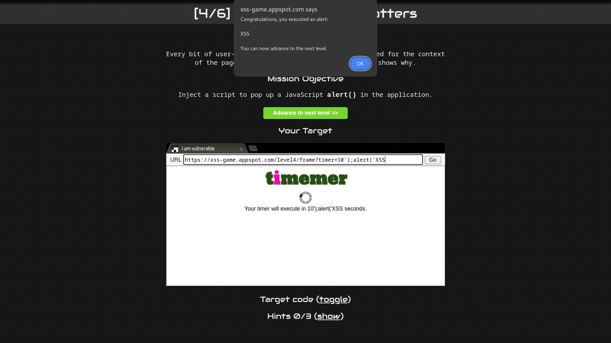

# Level 4: Context matters

URL: [https://xss-game.appspot.com/level4](https://xss-game.appspot.com/level4)



## Mission Description

Every bit of user-supplied data must be correctly escaped for the context of the page in which it will appear.

## Analysis

The page has a create timer button that executes a get form action which is then passed to the page via the timer parameter.



Upon further inspection of the page `timer.html` line `21`, it was found that the value of the timer in the URL is passed to the `startTimer()` function by the onload attribute of an **`img`** tag.



```html

```

We can craft a javascript payload that, will get executed on the `onload` attribute pop the alert box.

```javascript
10');alert('XSS
10%27%29%3Balert%28%27XSS
```

### How does the payload work?

When we put `10')` it will close the `startTimer()` function and add an `alert()` as a separate code block.

### Our injected payload

```html

```


