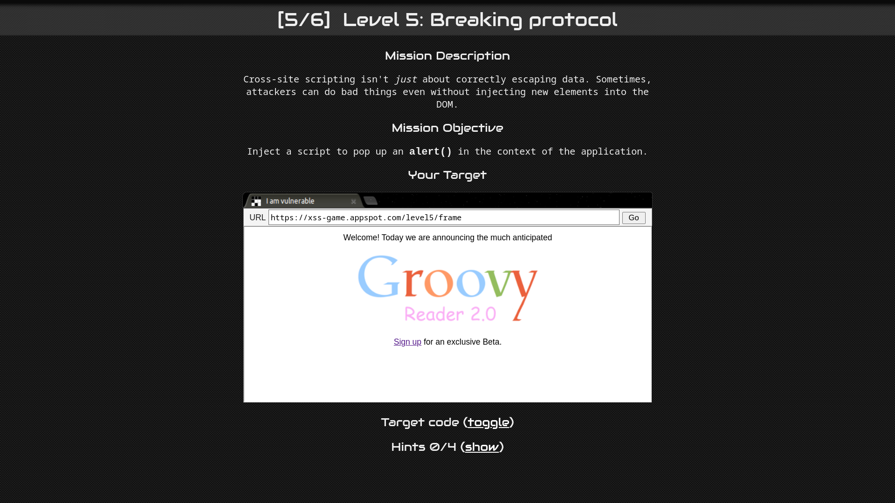
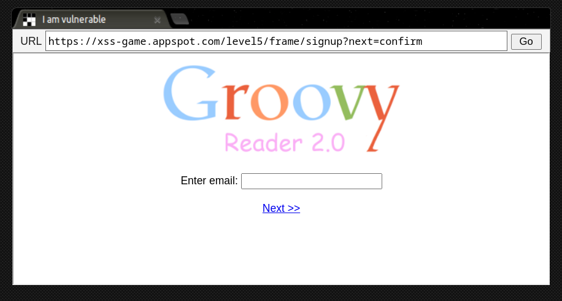
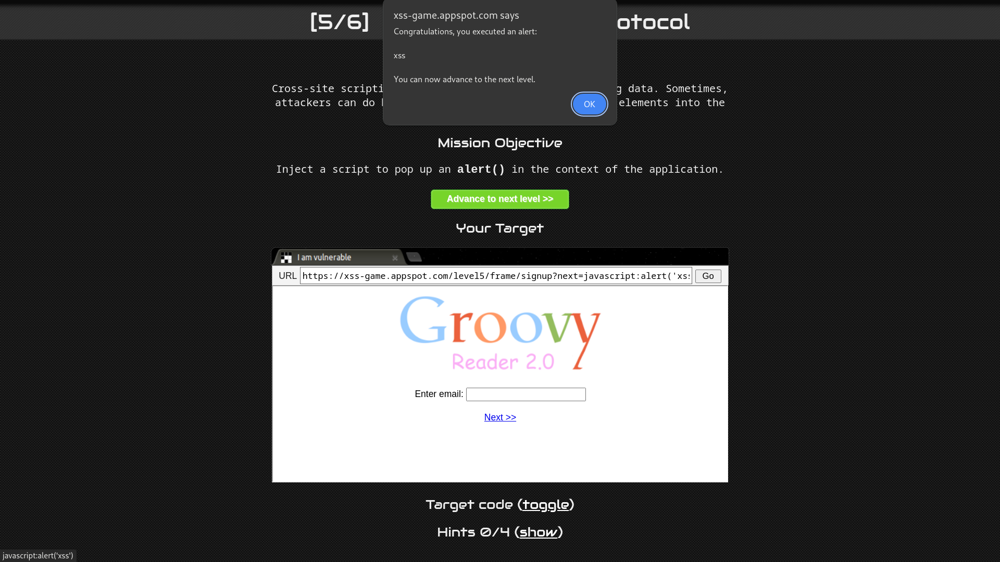

# Level 5: Breaking protocol

URL: [https://xss-game.appspot.com/level5](https://xss-game.appspot.com/level5)



## Mission Description

Sometimes, attackers can do bad things even without injecting new elements into the DOM

## Analysis

The `signup.html` page has a link that redirects to `/signup?next=confirm`. On the signup page line `15` there is an anchor tag with text content <ins>`Next >>`</ins> link that redirects to `confirm`.



```html
<a href="confirm">Next >></a>
```

## Conclusion

The href value of this anchor tag is determined by the next query parameter on the URL. We can fool this parameter by injecting javascript code into it, executing the alert function.

```bash
https://xss-game.appspot.com/level5/frame/signup?next=javascript:alert('xss')
```

Request the page with above url and click on the <ins>`Next >>`</ins> anchor tag. It will execute an alert box.

